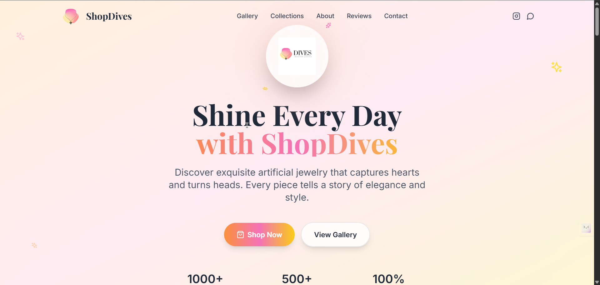
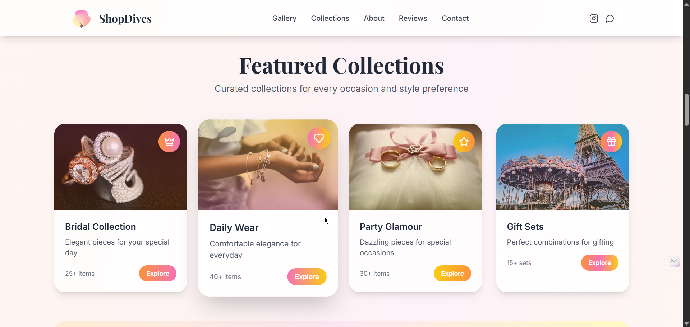
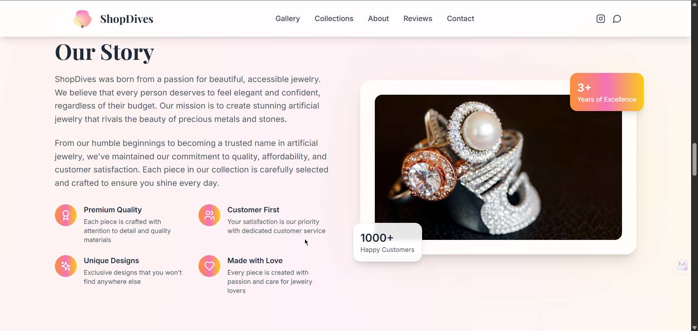
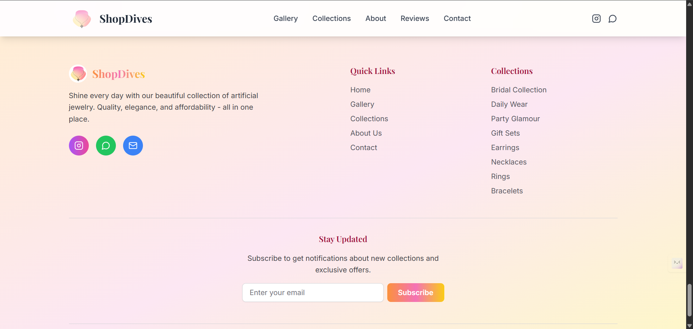

[](https://creativecommons.org/licenses/by-nc/4.0/)


<div align="center">
  <table>
    <tr>
      <td align="left" style="vertical-align: middle;">
        
        <h2 style="color: #d97706; margin-top: 10px;">
          Dives –<br/>
          The Elegant Artificial Jewelry Brand<br/>
          Showcasing Sparkle with Style ✨
        </h2>
      </td>
      <td align="right">
        
      </td>
    </tr>
  </table>
</div>


# ✨ ShopDives – Shine Every Day! ✨

Welcome to **ShopDives**, your go-to destination for stunning artificial jewelry that brings elegance, style, and confidence to your everyday look.  
Discover our handpicked collections, crafted with love and designed to make you shine! 💍🌸

---

## 🌟 Features

- **Beautiful Hero Section** – Eye-catching introduction with smooth scroll navigation.
- **Product Gallery** – Browse by category: Necklaces, Earrings, Rings, Bracelets, and more!
- **Featured Collections** – Curated sets for Bridal, Daily Wear, Party Glamour, and Gifts.
- **About Us** – Learn our story, values, and commitment to quality.
- **Testimonials** – Real reviews from happy customers across India.
- **Contact & Newsletter** – Easy ways to reach us and stay updated.
- **Responsive Design** – Looks great on all devices.
- **Modern Tech Stack** – Built with React, TypeScript, Tailwind CSS, and Vite.

---

## 🚀 Quick Start

1. **Clone the repository**
   ```sh
   git clone https://github.com/your-username/dives-the-jewelry-brand.git
   cd dives-the-jewelry-brand
   npm install
   npm run dev
   ```
   http://localhost:5173

---

## 🛠️ Tech Stack

• React + TypeScript
• Vite ⚡
• Tailwind CSS 🎨
• Lucide React Icons 🖼️

---

## 📁 Project Structure

├── public/           # Static assets (images, favicon)
├── src/
│   ├── components/   # React components (Hero, Gallery, Footer, etc.)
│   ├── [App.tsx](http://_vscodecontentref_/0)       # Main app layout
│   └── [main.tsx](http://_vscodecontentref_/1)      # Entry point
├── [index.html](http://_vscodecontentref_/2)        # HTML template
├── [tailwind.config.js](http://_vscodecontentref_/3)
├── [vite.config.ts](http://_vscodecontentref_/4)
└── ...

---

## 📸 Preview

<p align="center">
  
  
  
  
</p>


---

## 📫 Wanna Connect?

[](https://www.linkedin.com/in/piyush64bit)
[](mailto:piiyush.sonii@outlook.com)
[](https://piyushportfolio.live)

---

## 📝 License

This project is licensed under the Creative Commons Attribution-NonCommercial 4.0 International License.

--- 

## Made with ❤️ by P I Y U $ H
